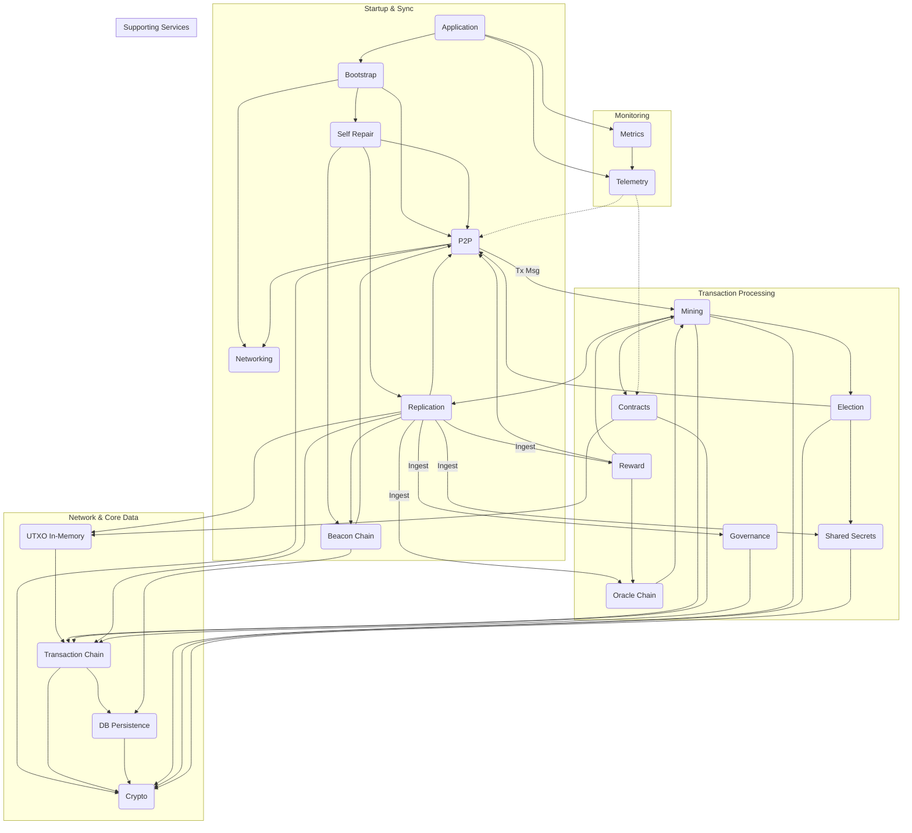

# Archethic Core Library (`lib/archethic`)

This directory contains the core logic for the Archethic blockchain node. It is decomposed into several distinct components, each responsible for a specific set of functionalities. These components interact to manage the blockchain's state, process transactions, handle network communication, and perform other essential tasks.

## Components Overview

Below is a summary of the main components identified within `lib/archethic`, derived primarily from the application's supervision tree (`lib/archethic/application.ex`).

*   **[DB](./db.md)**: Provides the persistence layer using a custom file-based implementation. Handles storage for transactions, beacon summaries, P2P info, etc. Accessed via a defined behaviour (`Archethic.DB`).
*   **[Transaction Chain](./transaction_chain.md)**: Manages the lifecycle of transactions (creation, validation assistance, access). Defines transaction structures (`Transaction`, `ValidationStamp`) and manages core ledger/UTXO logic. Delegates storage to `DB` and network fetches to `P2P`.
*   **[Crypto](./crypto.md)**: Handles all core cryptographic operations: hashing, signing, verification, key derivation (including daily nonces and origin keys), address generation, and encryption/decryption via keystores.
*   **[P2P](./p2p.md)**: Manages peer-to-peer network communication: node discovery, connection management (`MemTable`), message routing (including quorum requests), and geographical awareness (`GeoPatch`).
*   **[Election](./election.md)**: Selects validator and storage nodes using deterministic, verifiable algorithms based on transaction/chain data and daily nonce proofs.
*   **[Mining](./mining.md)**: Orchestrates transaction validation (stateless, ledger, contracts) and multi-node consensus workflows (`DistributedWorkflow`). Manages chain locking.
*   **[Beacon Chain](./beacon_chain.md)**: Acts as a coordination layer, aggregating network state (P2P view, sync status, replication attestations) into time-based slots and summaries across network subsets.
*   **[Shared Secrets](./shared_secrets.md)**: Manages time-sensitive daily nonce keys (used in Election) and origin keys via specific transaction types and scheduled renewals.
*   **[Replication](./replication.md)**: Handles final validation and storage of transactions post-consensus. Ingests transaction data into the `UTXO` component and loads network-specific transactions into other relevant components (`SharedSecrets`, `Governance`, etc.). Generates storage attestations.
*   **[Reward](./reward.md)**: Calculates node rewards based on participation and external data (UCO price from `OracleChain`). Schedules and creates reward distribution transactions (`:node_rewards`).
*   **[UTXO](./utxo.md)**: Manages the *in-memory* representation of the UTXO set (`MemoryLedger`) for efficient balance lookups. Updated by `Replication` after transactions are stored.
*   **[Governance](./governance.md)**: Manages code update proposals and approvals via specific transaction types (`:code_proposal`, `:code_approval`). Interacts with CI/CD and triggers testnet deployments.
*   **[Self Repair](./self_repair.md)**: Ensures node synchronization by comparing local state with `BeaconChain` markers, fetching missing data via `P2P`, and using `Replication` to store/ingest it. Handles bootstrap sync.
*   **[Oracle Chain](./oracle_chain.md)**: Fetches external data (e.g., UCO price from APIs), creates oracle-specific transactions (`:oracle`, `:oracle_summary`), and makes this data available on-chain.
*   **[Contracts](./contracts.md)**: Manages smart contract (interpreted & WASM) deployment, execution (`Worker`), and state. Called by `Mining` during validation.
*   **[Networking](./networking.md)**: Low-level utilities for discovering public IP (`IPLookup`) and attempting automatic port forwarding (`PortForwarding`) using UPnP/NAT-PMP.
*   **[Bootstrap](./bootstrap.md)**: Orchestrates node startup. Handles network initialization (first node) or node identity updates. Triggers `SelfRepair` synchronization.
*   **[Metrics](./metrics.md)**: Provides helper infrastructure (`ETSFlush`) to ensure Prometheus scraping works correctly with the telemetry pipeline.
*   **[Telemetry](./telemetry.md)**: Central point using Elixir's Telemetry ecosystem to define metrics, configure Prometheus exporter, and poll component states.

## High-Level Interactions

*   **Transaction Flow**: A typical transaction might enter via `P2P`, undergo initial validation and consensus coordinated by `Mining` (which uses `Election` to select validators, `Contracts` for smart contract execution, `TransactionChain` and `UTXO` for ledger checks, and `Crypto` for verification), get finalized with a `ValidationStamp`, passed to `Replication` for storage (updating `DB` via `TransactionChain`, updating `UTXO`'s in-memory view, and potentially updating `SharedSecrets`/`Governance`/etc.), and finally attested to in the `BeaconChain`.
*   **Synchronization**: `Bootstrap` initiates startup, potentially creating genesis blocks or updating node identity, then triggers `SelfRepair`. `SelfRepair` uses `BeaconChain` summaries as reference points, fetches missing data via `P2P` (using `Election` to find peers), and uses `Replication` to store and ingest the data.
*   **Network State**: `P2P` maintains the view of connected peers (`MemTable`), updated periodically by `Networking` (IP changes) and `BeaconChain` (`Update` module processing aggregated availability/sync data).
*   **Time-Based Operations**: `SharedSecrets` rotates daily nonce keys used by `Election` based on scheduled transactions. `Reward` calculates and distributes rewards based on `OracleChain` data and scheduled transactions. `OracleChain` fetches external data on a schedule.

For detailed information on each component, please refer to the individual markdown files linked above.

## Component Dependency Diagram

